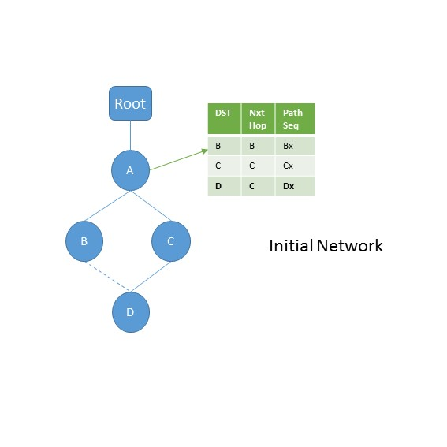
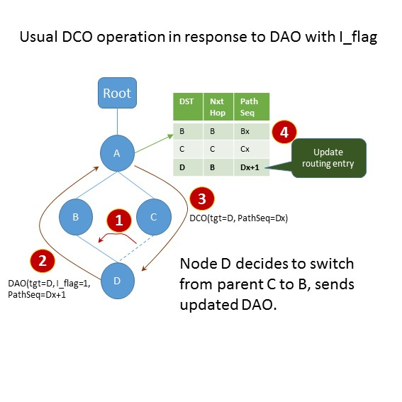
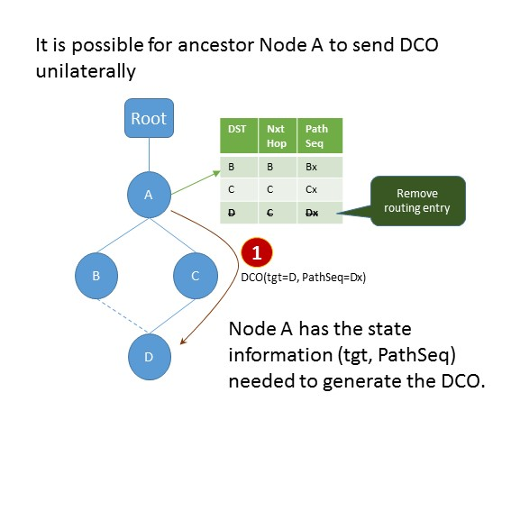

# Unilateral DCO

The draft adds DCO msg which allows route invalidation by the common ancestor node. The DCO message is generated by the ancestor node in response to DAO with I-flag (invalidate previous route flag) set in context to the corresponding target. The I-flag is used as a mechanism so that the target is in-charge of its own invalidation. Having said that, the ancestor node has all the state information needed to generate the DCO __unilaterally__. Should this be allowed?

Initial         | Usual DCO        | Unilateral DCO  |
:--------------:|:----------------:|:---------------:|
  |    |   |
